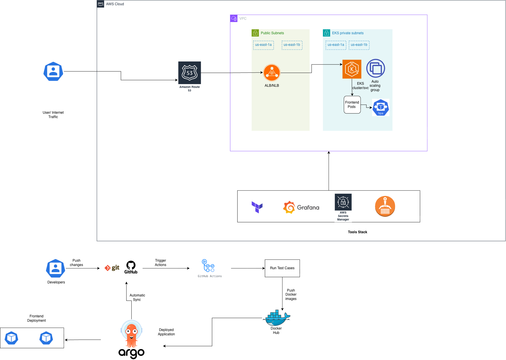

# SimpleTimeService

A minimal Node.js microservice that returns the current timestamp and the visitor's IP address as JSON, containerized and deployed to AWS EKS using Terraform.

> **Current Settings**
> This repo is configured with the following defaults for the remote state backend. **Feel free to change these to your own** before deploying — just update the values below wherever they're referenced (backend blocks in each module).
> - S3 bucket: `tf-state-aws-bucket01`
> - DynamoDB lock table: `terraform-lock`
> - Region: `us-east-1`

```json
{
  "timestamp": "2026-07-26T10:00:00.000Z",
  "ip": "203.0.113.5"
}
```

## Repository Structure

```
.
├── app/                              # Application source code + Dockerfile
├── infrastructure/aws/network/       # VPC, subnets, NAT/IGW, routing (Terraform module)
├── infrastructure/aws/eks/           # EKS cluster + node groups (Terraform module)
├── infrastructure/aws/k8-apps/       # ALB Controller, app deployment, Ingress (Terraform module)
├── vars/                             # Environment-specific .tfvars files
└── .github/workflows/                # CI/CD pipeline (build, test, push image)
```

Each module folder has its own README with module-specific architecture and variable details:
- [`app/README.md`](app/README.md) — Application build, test, and container details
- [`infrastructure/aws/network/README.md`](infrastructure/aws/network/README.md) — VPC/networking design
- [`infrastructure/aws/eks/README.md`](infrastructure/aws/eks/README.md) — EKS cluster design
- [`infrastructure/aws/k8-apps/README.md`](infrastructure/aws/k8-apps/README.md) — App deployment & Ingress/ALB setup

## Architecture



- **VPC** with public and private subnets across multiple Availability Zones.
- **Amazon EKS** cluster — application pods run in **private subnets only**.
- **AWS Load Balancer Controller** provisions an **Application Load Balancer (ALB)** in the public subnets via a Kubernetes Ingress, exposing the app to the internet.
- **NAT Gateway** in the public subnet allows private-subnet workloads outbound internet access (image pulls, package updates) without being publicly reachable themselves.
- **Container image** is published to Docker Hub and pulled by the cluster at deploy time.

### Why this architecture

EKS was chosen over a simpler option (e.g. plain EC2 or ECS) to demonstrate production-grade, cloud-native infrastructure: Kubernetes gives us declarative rollouts, self-healing, and a clear path to add autoscaling, health checks, and further workloads without re-architecting. The ALB + Ingress pattern (Layer 7) is used instead of a plain Service LoadBalancer (Layer 4/NLB) because it supports host/path-based routing, TLS termination, and is the AWS-recommended pattern for exposing HTTP workloads running in private subnets.

## Prerequisites

Before deploying, make sure you have:

1. **An AWS account** with permissions to create VPC, EKS, IAM, ALB, S3, and DynamoDB resources.
2. **An IAM user/role with programmatic access** (Access Key ID + Secret Access Key).
3. **An S3 bucket** to store Terraform remote state (create this once, manually, before running Terraform — see below).
4. **A DynamoDB table** for Terraform state locking (create this once, manually, before running Terraform — see below).
5. The following tools installed locally:

| Tool | Purpose | Install Guide |
|---|---|---|
| AWS CLI v2 | Authenticate to AWS | https://docs.aws.amazon.com/cli/latest/userguide/getting-started-install.html |
| Terraform (>= 1.6) | Provision infrastructure | https://developer.hashicorp.com/terraform/install |
| kubectl | Interact with the EKS cluster | https://kubernetes.io/docs/tasks/tools/install-kubectl/ |
| Helm | (Optional) install cluster add-ons | https://helm.sh/docs/intro/install/ |
| Docker | Build/test the container image locally | https://docs.docker.com/get-docker/ |

### Install AWS CLI (Linux)
```bash
curl "https://awscli.amazonaws.com/awscli-exe-linux-x86_64.zip" -o "awscliv2.zip"
unzip awscliv2.zip
sudo ./aws/install
aws --version
```

### Install Terraform (Ubuntu/Debian)
```bash
wget -O- https://apt.releases.hashicorp.com/gpg | \
  sudo gpg --dearmor -o /usr/share/keyrings/hashicorp-archive-keyring.gpg
echo "deb [signed-by=/usr/share/keyrings/hashicorp-archive-keyring.gpg] https://apt.releases.hashicorp.com $(lsb_release -cs) main" | \
  sudo tee /etc/apt/sources.list.d/hashicorp.list
sudo apt update && sudo apt install terraform -y
terraform -version
```

### Install kubectl (Ubuntu/Debian)
```bash
curl -fsSL https://pkgs.k8s.io/core:/stable:/v1.33/deb/Release.key | \
  sudo gpg --dearmor -o /etc/apt/keyrings/kubernetes-apt-keyring.gpg
echo "deb [signed-by=/etc/apt/keyrings/kubernetes-apt-keyring.gpg] https://pkgs.k8s.io/core:/stable:/v1.33/deb/ /" | \
  sudo tee /etc/apt/sources.list.d/kubernetes.list
sudo apt update && sudo apt install kubectl -y
kubectl version --client
```

### Install Helm (Ubuntu/Debian)
```bash
curl -fsSL -o get_helm.sh https://raw.githubusercontent.com/helm/helm/main/scripts/get-helm-3
chmod +x get_helm.sh
./get_helm.sh
helm version
```

## One-Time Setup: Remote State Backend

Terraform state and locking require an S3 bucket and a DynamoDB table. Create these **once**, before running `terraform apply` (they are outside the scope of the Terraform code itself, to avoid a chicken-and-egg problem with state storage).

**Create the S3 bucket** (bucket names must be globally unique):
```bash
aws s3api create-bucket \
  --bucket tf-state-aws-bucket01 \
  --region us-east-1

aws s3api put-bucket-versioning \
  --bucket tf-state-aws-bucket01 \
  --versioning-configuration Status=Enabled
```

**Create the DynamoDB lock table:**
```bash
aws dynamodb create-table \
  --table-name terraform-lock \
  --attribute-definitions AttributeName=LockID,AttributeType=S \
  --key-schema AttributeName=LockID,KeyType=HASH \
  --billing-mode PAY_PER_REQUEST \
  --region us-east-1
```

Then ensure the backend configuration in each module (`infrastructure/aws/network`, `infrastructure/aws/eks`, `infrastructure/aws/k8-apps`) points to your bucket and table names:
```hcl
terraform {
  backend "s3" {
    bucket         = "tf-state-aws-bucket01"
    key            = "simpletimeservice/<module-name>/terraform.tfstate"
    region         = "us-east-1"
    dynamodb_table = "terraform-lock"
    encrypt        = true
  }
}
```
> Each module uses its own `key` path in the same bucket, and Terraform **workspaces** (e.g. `dev`) further isolate state per environment within each module — see [Deploying the Infrastructure](#deploying-the-infrastructure) below.

## Authenticate to AWS

Configure your AWS credentials so Terraform and the AWS CLI can authenticate:

```bash
aws configure
```
You'll be prompted for:
- AWS Access Key ID
- AWS Secret Access Key
- Default region (e.g. `us-east-1`)
- Default output format (e.g. `json`)

Alternatively, export credentials as environment variables:
```bash
export AWS_ACCESS_KEY_ID="<your-access-key-id>"
export AWS_SECRET_ACCESS_KEY="<your-secret-access-key>"
export AWS_DEFAULT_REGION="us-east-1"
```

> **Never commit AWS credentials to the repository.** Use `aws configure`, environment variables, or an AWS profile — not hardcoded values in `.tf` files.

## Deploying the Infrastructure

Infrastructure is split into three Terraform modules, deployed **in order** — each depends on resources created by the previous one. All three use a Terraform **workspace** (`dev`) to isolate state for the environment being deployed.

### 1. Network (VPC, subnets, NAT/IGW)
```bash
cd infrastructure/aws/network
terraform init
terraform workspace new dev        # use 'terraform workspace select dev' if it already exists
terraform plan --var-file=../../vars/global-network.tfvars
terraform apply --var-file=../../vars/global-network.tfvars
```

### 2. EKS (cluster + node groups)
```bash
cd infrastructure/aws/eks
terraform init
terraform workspace new dev        # use 'terraform workspace select dev' if it already exists
terraform plan --var-file=../../vars/global-eks.tfvars
terraform apply --var-file=../../vars/global-eks.tfvars
```

### 3. K8s Apps (ALB Controller, ArgoCD, monitoring)
```bash
cd infrastructure/aws/k8-apps
terraform init
terraform workspace new dev        # use 'terraform workspace select dev' if it already exists
terraform plan
terraform apply
```

Type `yes` when prompted at each `apply` step. Default values for each module's variables are provided in the corresponding `vars/*.tfvars` file — override with additional `-var` flags if needed.

> **Note:** `terraform workspace new dev` will fail with "workspace already exists" if you've already created it in a prior run — in that case use `terraform workspace select dev` instead, then continue with `plan`/`apply`.

### 4. Bootstrap the Application via ArgoCD

At this point, ArgoCD and monitoring are running, but the **application itself isn't deployed yet** — it needs to be registered in ArgoCD and synced via the CI/CD pipeline. Follow these steps in order:

**a. Connect kubectl to the cluster**
```bash
aws eks update-kubeconfig --region us-east-1 --name <cluster-name>
```

**b. Fetch the ArgoCD admin password**
```bash
kubectl -n argocd get secret argocd-initial-admin-secret -o jsonpath="{.data.password}" | base64 -d
```
Username: `admin`

**c. (Optional) Fetch the Grafana admin password**
```bash
kubectl -n monitoring get secret <release-name>-grafana -o jsonpath="{.data.admin-password}" | base64 -d
```
Username: `admin` (replace `<release-name>-grafana` with your actual Grafana secret name — find it via `kubectl -n monitoring get secrets | grep grafana`)

**d. Log into ArgoCD and create the application**
Get the ArgoCD server URL:
```bash
kubectl get ingress -n argocd
```
Log in (UI or CLI) with the `admin` credentials from step b, then create a new Application named **`node-app`** pointing at this repo's app manifests/path.

**e. Push your changes to GitHub**
```bash
git add .
git commit -m "Deploy node-app"
git push origin main
```
This triggers the GitHub Actions pipeline, which builds the image, pushes it to Docker Hub, and updates the image tag ArgoCD watches — ArgoCD then syncs `node-app` into the cluster automatically.

**f. Verify the deployment**
Once ArgoCD shows `node-app` as `Synced`/`Healthy`, get its Ingress to confirm the app is reachable:
```bash
kubectl get ingress -n <node-app-namespace>
curl http://<alb-dns-name>/
```

Expected response:
```json
{
  "timestamp": "2026-07-26T10:00:00.000Z",
  "ip": "203.0.113.5"
}
```

## Currently Deployed Resources

The following URLs provide access to deployed platform components (dev environment).

| Service | Environment | URL |
|----------|------------|-----|
| Frontend Application | Dev | http://k8s-frontend-frontend-fa5a354a1b-e003c1529fc4adf0.elb.us-east-1.amazonaws.com/ |
| ArgoCD | Dev | http://k8s-argocd-argocd-35c95ecac2-224874988.us-east-1.elb.amazonaws.com/ |
| Grafana | Dev | http://k8s-monitori-devmonit-faef1db893-715403829.us-east-1.elb.amazonaws.com/ |

> ArgoCD and Grafana login credentials have been shared separately via email.

## Container Image

The image is publicly available on Docker Hub:
```
docker pull shivamaglwork/node-app:latest
```

- Runs as a **non-root user** inside the container.
- Built on a minimal Alpine base to keep image size small.

## CI/CD

A GitHub Actions workflow (`.github/workflows/`) automatically:
1. Runs the test suite on every push to `main`.
2. Builds the Docker image.
3. Pushes it to Docker Hub, tagged with the 8-character short commit SHA and `latest`.

## Tearing Down

To avoid ongoing AWS charges, destroy all provisioned resources when done — **in reverse order** (k8-apps → eks → network), since later modules depend on earlier ones:

### 1. K8s Apps
```bash
cd infrastructure/aws/k8-apps
terraform workspace select dev
terraform destroy
```

### 2. EKS
```bash
cd infrastructure/aws/eks
terraform workspace select dev
terraform destroy --var-file=../../vars/global-eks.tfvars
```

### 3. Network
```bash
cd infrastructure/aws/network
terraform workspace select dev
terraform destroy --var-file=../../vars/global-network.tfvars
```

Type `yes` when prompted at each step.

> Optional cleanup: once you no longer need the `dev` workspace in a module, you can remove it with `terraform workspace select default && terraform workspace delete dev`.

You are responsible for manually deleting the S3 bucket and DynamoDB table created in the one-time setup step, if no longer needed:
```bash
aws s3 rb s3://tf-state-aws-bucket01 --force
aws dynamodb delete-table --table-name terraform-lock
```

## Notes

- This project was built as a solution to a DevOps take-home challenge, demonstrating containerization, IaC, and cloud networking best practices.
- Infrastructure is provisioned via `terraform plan` / `terraform apply` per module — no manual AWS console steps are required beyond the one-time backend setup and workspace creation described above.
