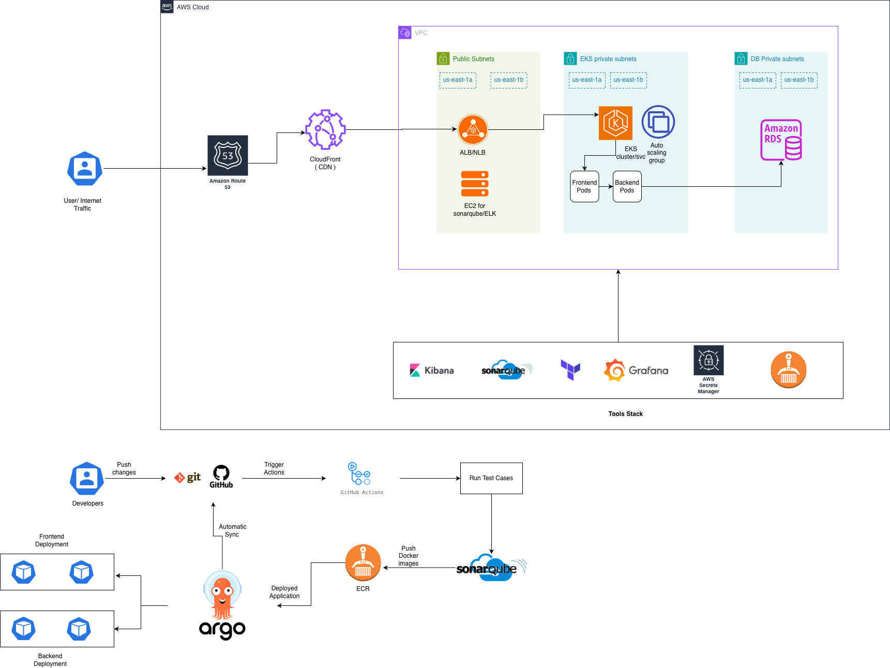

# Infrastructure Setup for Sample web Application

## Overview

This repository contains Terraform code used to provision and manage AWS infrastructure resources.

The infrastructure is organized into independent domains to simplify deployment, maintenance, and ownership.

## Repository Structure

```text
infrastructure/
├── aws/
│   ├── network/
│   ├── eks/
│   └── k8-apps/
├── modules/
├── vars/
└── apps/
```

## Components

| Component | Description |
|------------|-------------|
| network | VPC, Subnets, Route Tables, NAT Gateways, Security Groups |
| eks | Amazon EKS clusters and node groups |
| observability in EKS | Prometheus, Grafana and monitoring stack |
| k8-apps | Kubernetes add-ons and platform applications |

## Deployment Order

1. Network
2. EKS
3. Observability in EKS
4. Kubernetes Applications

## Prerequisites

- Terraform >= 1.5
- AWS CLI
- kubectl
- Helm
- AWS IAM permissions

## Architecture



## Terraform Commands

Initialize:

```bash
terraform init
```

Validate:

```bash
terraform validate
```

Plan:

```bash
terraform plan
```

Apply:

```bash
terraform apply
```

Destroy:

```bash
terraform destroy
```

## State Management

Terraform state is stored remotely using the backend configuration defined within each module on s3. 

## Environment Management

This repository uses Terraform Workspaces to manage environment-specific deployments.

Each environment must have a corresponding workspace:

| Environment | Workspace |
|-------------|------------|
| Development | dev |
| QA | qa |
| Production | prod |

Before running any Terraform commands, ensure the correct workspace is selected.

Create a workspace:

```bash
terraform workspace new dev
terraform workspace new qa
terraform workspace new prod
```

Select a workspace:

```bash
terraform workspace select dev
```

Verify current workspace:

```bash
terraform workspace show
```

Note: Resource naming is workspace-aware and resources are provisioned separately for each environment.

## Currently Deployed Resources

The following URLs provide access to deployed platform components.

| Service | Environment | URL |
|----------|------------|-----|
| Frontend Application | Dev | http://k8s-frontend-frontend-fa5a354a1b-e003c1529fc4adf0.elb.us-east-1.amazonaws.com/ |
| ArgoCD | Dev | http://k8s-argocd-argocd-35c95ecac2-224874988.us-east-1.elb.amazonaws.com/ |
| Grafana | Dev | http://k8s-monitori-devmonit-faef1db893-715403829.us-east-1.elb.amazonaws.com/ |